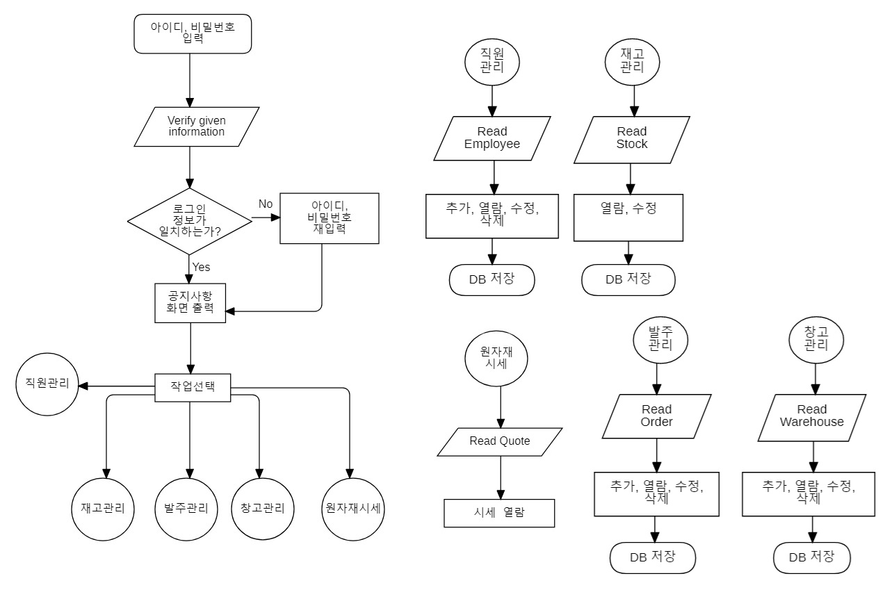

# 원자재 재고 관리 시스템

## 개요

제철소의 광물 원자재의 입고, 출고, 주문 내역을 관리하고, 시스템에 접속하는 로그인 직원 정보를 관리하는 제조업 회사의 재고 관리 기능의 일부를 구현 하였습니다.

## 개발기간
2020년 11월 23일 ~ 11월 29일

# 개발 환경

## 공통

### 데이터베이스
Microsoft MS-SQL Server 2019

## C# MES Client project
Microsoft Visual Studio Community 2019 v16.8.2

#### 언어
- C# 8.0

#### 프레임워크

- .Net FrameWork 4.8
- EntityFrameWork 6.2
- Winform

## RFID tag information reader Client
Arduino Sketch 1.8.13

#### 언어 및 라이브러리
C++, MFRC522 library(RFID library)

#### 하드웨어
Arduino Mega 2560, RFID RC522 Module

## 화면 목록
1. 로그인

재고 관리 시스템에 ID, 암호를 입력하여 로그인 기능 제공

- 부여된 ID와 비밀번호로 로그인
- 로그인 전에는 상단의 탭 이용 불가
  - 로그인 실패
    - ID 또는 비밀번호 다르면 로그인 실패 메시지박스 출력
  - 로그인 성공
    - 로그인 정보 중에 이름을 메시지 박스에 출력

2. 직원 관리

직원의 리스트를 트리뷰 컨트롤에 출력하고 직원 정보를 수정, 조회, 등록 기능 제공
- 로그인 후 초기 화면으로 우측에는 사진, 좌측에는 공지사항 위치

- 직원 정보 트리뷰 출력 및 좌측 텍스트박스에 직원 상세정보 출력

     - 등록된 직원 정보를 좌측의 트리뷰로 출력
     - 트리뷰에서 직원 이름 클릭 시 좌측 텍스트박스에 직원 상세 정보 출력

- 조회버튼
      - 하단의 직원 ID 텍스트박스와 조회 버튼으로 등록된 직원 정보를 바로 위 텍스트박스에 출력
   - 수정버튼
      - 조회버튼 또는 트리뷰 클릭으로 직원 정보가 출력된 상태에서 좌측 텍스트 박스에 수정 정보를 입력 가능하며, 수정 버튼 클릭시 직원 정보 수정
   - 새직원 추가버튼
      - 화면 기준 좌측에 위치한 텍스트박스가 초기화 되고, 자동으로 부여된 직원 ID를 제외하고 텍스트박스에 새직원 정보를 입력할 수 있다.
   - 새직원 추가 시 상이한 데이터 입력
      - 텍스트박스에 입력 규칙을 벗어나게 되면, 오류 메시지 박스 출력
   - 새직원 등록버튼
      - 새직원 추가 부분을 통해 입력된 새직원 정보를 등록하는 버튼으로 클릭시 입력된 정보가 DB에 전송 및 저장 

3. 재고 관리

원자재의 입/출고 이력 조회, 기간과 원자재 ID 등의 검색 조건에 의한 조회 기능 제공

- 조회버튼
      -최초 조회버튼만 클릭 시 전체 데이터 출력
      -하단의 기간 체크박스 설정 후 좌측의 시간 기준 날짜를 정하고 조회버튼 클릭 시 해당 기간 입, 출고 기록 정보 출력
       -하단의 원자재 체크박스 설정 후 조회버튼 클릭 시 해당 기간의 원자재 입,출고 기록 정보 출력
   - Page 콤보박스
      - 콤보박스로 페이지 선택 후 조회 버튼 클릭 시 입, 출고 기록 정보 출력
   - 수정버튼
      - 그리드에서 수정하고 싶은 데이터 클릭 후, 수정 버튼을 누르면 해당 입,출고 기록 수정가능

4. 발주 관리

원자재 발주 등록, 수정, 조회 기능 제공

- 하단 콤보박스 및 조회버튼
      - 주문 번호 또는 수입처 선택 후 좌측의 텍스트박스에 조회하고픈 정보를 입력 후 조회버튼 클릭 시 상단의 그리드에 정보 출력
- 수정버튼
      - 그리드에서 수정하고 싶은 데이터 클릭 후, 수정 버튼을 누르면 해당 그리드 수정 가능
- 추가버튼
      - 새로운 주문 데이터 추가
-삭제버튼
      - 그리드에서 삭제하고 싶은 데이터 클릭 후 , 삭제 버튼을 누르면 최종 삭제 여부 메시지박스 출력 후 확인을 누르면 해당 데이터 삭제

5. 창고 관리

창고에 보관된 원자재 정보 수정, 추가, 삭제 기능

- 콤보박스 및 조회버튼
      - 콤보박스는 창고정보(ID)를 갖고 있고 해당 창고로 선택 후 조회버튼을 누르면 하단 그리드에 해당 창고 정보만 출력
- 수정버튼
      - 상단 그리드에서 창고 정보를 클릭 후 수정버튼을 누르면 해당 창고정보 수정 가능
- 추가버튼
      - 새로운 창고 정보를 등록 할 수 있으며, 상단 그리드 뷰에서 데이터 출력
- 삭제버튼
      - 그리드에서 삭제하고 싶은 데이터 클릭 후 , 삭제 버튼을 누르면 최종 삭제 여부 메시지박스 출력 후 확인을 누르면 해당 데이터 삭제

6. 원자재 시세

원자재 시세 조회, 구매에 참고할 수 있는 정보 제공

- 원자제 시세 정보 화면
- 좌측에는 기간별 원자재 시세 그래프 출력
- 우측에는 기간별 원자재 시세 그리드 출력
- 우측 상단의 기간 조회로 그래프 및 그리드 원하는 기간으로 조회 가능
- 하단의 원자재 별 체크박스로 해당 원자재 그래프만 출력
- 초기화면 버튼으로 초기화가능

# 순서도

# DB 스키마

  - 모든 항목이 제 3 정규화까지 완료됐다.

## 발생한 이슈
1. 입출고 화면에서 기간, 리소스 ID 없이 조회하는 경우 쿼리 결과가 많으므로 조회중에 UI가 멈추는 현상이 발생한다.

## 해결 방법
1. 데이터가 많아서 한번에 출력할 수가 없으므로 전체 결과 건수를 조사하고 특정 개수만큼 나눠서 화면에 출력하는 방법으로 해결하였다.

## 개선할 점
1. 